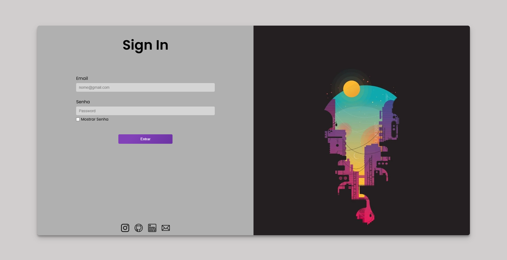
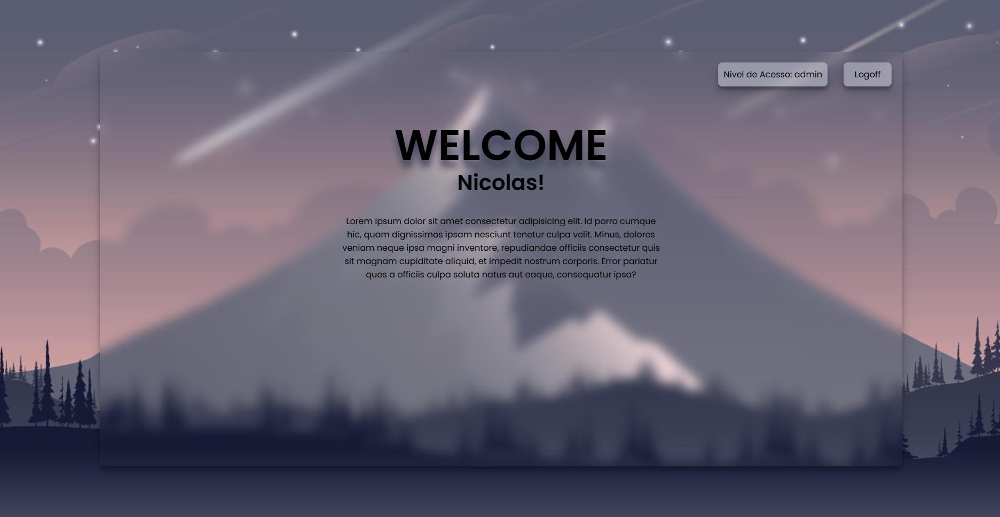

# 🖥 Site de Login com PHP


## 📌 Descrição

Este é um site simples de login com gerenciamento de níveis de acesso (usuário comum e administrador) desenvolvido com PHP. O projeto foi criado como exercício de fixação para a disciplina de Linguagem de Programação da FATEC Bragança Paulista.

## 🎯 Objetivo

Fixar os conceitos de autenticação de usuários, manipulação de sessões e controle de acesso baseado em níveis de permissão utilizando PHP, HTML5 e CSS3. O projeto também aborda responsividade com Media Queries.

## 🚀 Tecnologias Utilizadas

- PHP
- HTML5
- CSS3
- Responsividade com Media Queries

## 🧰 Funcionalidades

- Login com email e senha
- Diferenciação de acesso entre usuário comum e administrador
- Interface responsiva para dispositivos móveis
- Feedback visual para erros de login
- Logout com destruição de sessão

## ⚙ Pré-requisitos

- Servidor local (como XAMPP, WAMP, Laragon, etc.)
- PHP instalado (>= 7.4)
- Navegador moderno

## 🛠 Instalação e Execução

1. Clone o repositório:

```bash
git clone https://github.com/seu-usuario/seu-repositorio.git
```

2. Mova a pasta do projeto para o diretório `htdocs` (XAMPP) ou equivalente no seu servidor local.

3. Inicie o servidor Apache pelo seu gerenciador (ex: XAMPP).

4. Acesse o projeto pelo navegador:

```
http://localhost/nome-do-projeto
```

## 🔒 Contas de Acesso para Teste

| Email                | Senha     | Nível de Acesso |
|---------------------|-----------|-----------------|
| nicolas@abc.com     | 123456    | Admin           |
| joao@abc.com        | 12456     | Admin           |
| bia@abc.com         | puro      | User            |
| juliano@abc.com     | 89745     | User            |
| margarida@abc.com   | 1245Aef   | User            |


## 📷 Pré-visualização

### Tela de Login (Desktop)


### Tela Inicial (Home) - Desktop


### Tela de Login e Inicial (Home) - Mobile


## 📜 Licença

Este projeto está licenciado sob a Licença MIT. Veja o arquivo [LICENSE](LICENSE) para mais informações.

---

*Projeto educacional desenvolvido para fins de aprendizado.*
